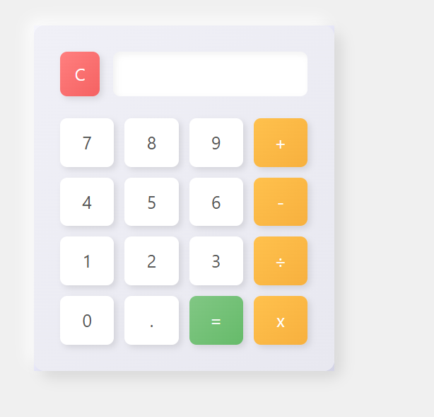

# Simple Calculator (HTML, CSS, JavaScript)

This is a basic calculator built using HTML for structure, CSS for styling, and JavaScript for functionality. It supports the following operations: addition (+), subtraction (-), multiplication (x), and division (÷). It also includes a clear button (C) and decimal point (.) functionality.

## Features

* Performs basic arithmetic operations: +, -, x, ÷
* Clear button (C) to reset the display.
* Handles decimal input.
* Basic error prevention (e.g., preventing multiple operators or leading operators).
* Simple and attractive user interface.

## Technologies Used

* HTML5
* CSS3
* JavaScript (ES6)

## How to Use

1.  Clone or download the repository to your local machine.
2.  Open the `index.html` file in your web browser.
3.  Use the on-screen buttons to perform calculations. The result will be displayed in the input field at the top.

## Output Screenshot

*(Make sure you have a file named `calculator.png` in the same directory as your `README.md` file for the image to display correctly.)*

## Project Structure
├── index.html
├── index.js
├── style.css
└── calculator.png  <-- Output screenshot (if you add one)
└── README.md

 `index.js`: The JavaScript file containing the calculator's logic.
* `style.css`: The CSS file containing the styling for the calculator.
* `calculator.png`: (Optional) A screenshot of the calculator's output.
* `README.md`: This file, providing a description of the project.

## Further Improvements (Optional)

* Implement keyboard support for input.
* Add memory functions (MC, MR, M+, M-).
* Implement more advanced mathematical functions (square root, percentages, etc.).
* Improve error handling and display more informative error messages.
* Refactor the JavaScript code for better organization and readability.
* Make the design responsive for different screen sizes.

## Author

[[https://github.com/msaqlain143]]
